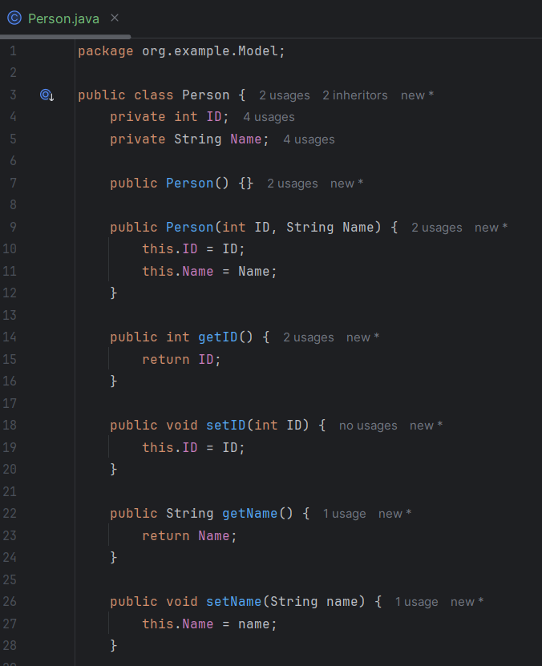
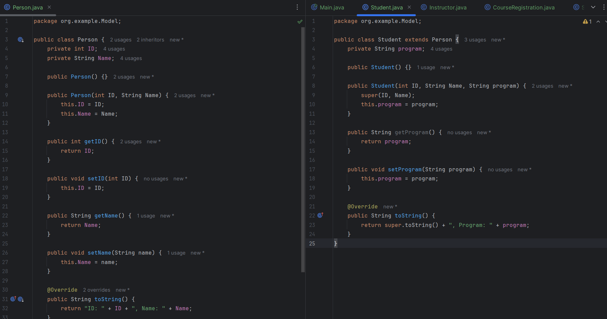
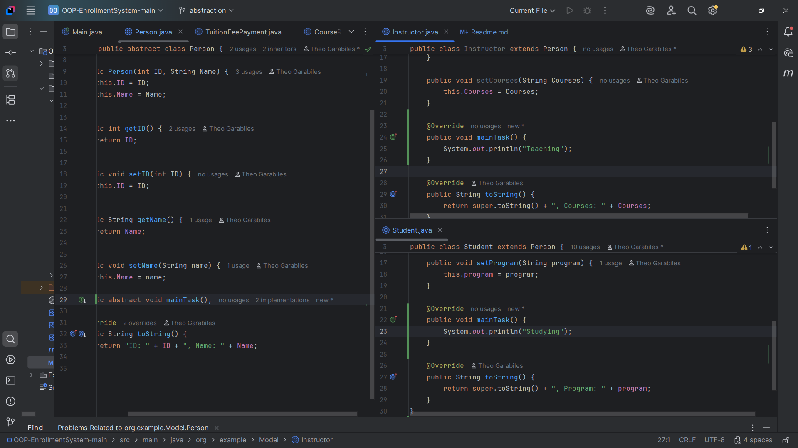

# OOP Enrollment System

---
**Author**: Theo Garabiles

**1.Encapsulation**: Classes *Student* and *Course* were made using a provided UML
to practice the Access Modifiers and Getters/Setters.

**2.Inheritance**: Classes *Student* and *Instructor* extend the *Person* class
to practice Inheritance and code reusability.

**3.Abstraction**: The *Person* class is abstract, with `mainTask()` implemented by its subclasses.

